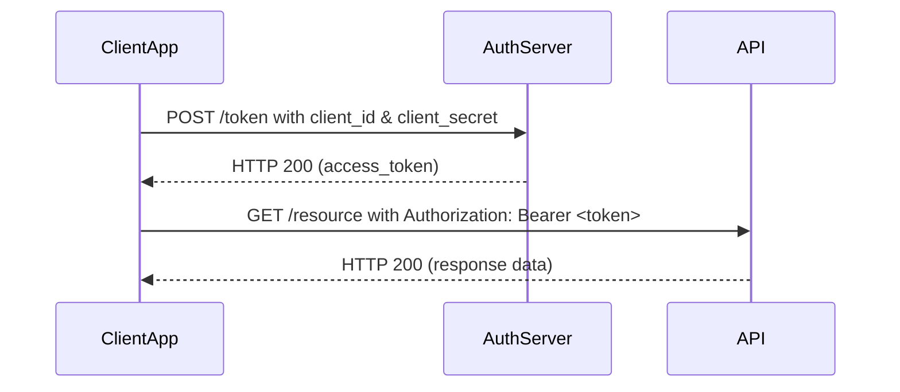

# OAuth2 Client Credentials Flow – Implementation Guide

## Overview

This document outlines the implementation details for the OAuth2 **Client Credentials Flow**, intended for secure, backend service-to-service communication. It is suitable in cases where the application needs to access resources or APIs on its own behalf, without user interaction.

This flow is commonly used in microservice architectures, automated jobs, background processes, and systems integration.

## Use Cases

- A backend service authenticating to an external API.
- Microservices communicating with each other securely.
- Scheduled jobs requiring access to a protected resource.
- Internal tooling or daemons performing non-user-specific operations.

## Flow Description

The Client Credentials Flow involves the following steps:

1. The client application authenticates directly with the authorization server using its `client_id` and `client_secret`.
2. It requests an access token from the token endpoint.
3. Upon successful validation, the server issues an access token.
4. The client includes this token in the `Authorization` header of subsequent API calls.

## Sequence Diagram



## Implementation Steps

### 1. Register the Client

Register the application with the OAuth2 provider (e.g., Azure AD, Auth0, Okta) and obtain:

- `client_id`
- `client_secret`
- `token_endpoint`
- Allowed scopes or roles (e.g., `api.read`)

Ensure these credentials are securely stored and rotated as needed.

### 2. Request an Access Token

Make a POST request to the authorization server's token endpoint with the following parameters:

**Request:**

```http
POST /oauth2/token
Host: auth.example.com
Content-Type: application/x-www-form-urlencoded

grant_type=client_credentials&
client_id=your-client-id&
client_secret=your-client-secret&
scope=api.read
```

**Response:**

```json
{
  "access_token": "eyJ...xyz",
  "token_type": "Bearer",
  "expires_in": 3600
}
```

Store the `access_token` securely in memory. Do not persist it unless absolutely necessary.

### 3. Use the Token for API Access

Include the access token in the Authorization header of your request to any protected API resource.

**Example:**

```http
GET /v1/data
Host: api.example.com
Authorization: Bearer eyJ...xyz
```

## Security Considerations

- **Credential Management**: Store `client_secret` in a secure configuration system or secret manager (e.g., AWS Secrets Manager, HashiCorp Vault).
- **Transport Security**: All communication with the authorization server and resource servers must occur over TLS (HTTPS).
- **Token Expiry**: Monitor token expiry and renew as needed; do not assume indefinite validity.
- **Access Scoping**: Use the minimum set of scopes or roles required for operation.
- **Audit Logging**: Log token requests, usage, and failures to support traceability and incident response.

## Responsibilities

| Role           | Responsibility                                                                 |
| -------------- | ------------------------------------------------------------------------------ |
| Architect      | Define flow integration pattern, ensure alignment with org-wide auth practices |
| Staff Engineer | Implement token request mechanism and secure API client                        |
| DevOps         | Secure credential storage, rotate secrets, monitor token requests              |

## Deliverables

- Token acquisition module, testable and modular
- Secure client wrapper for API access
- Unit and integration tests covering token request and usage
- Documentation of configuration parameters
