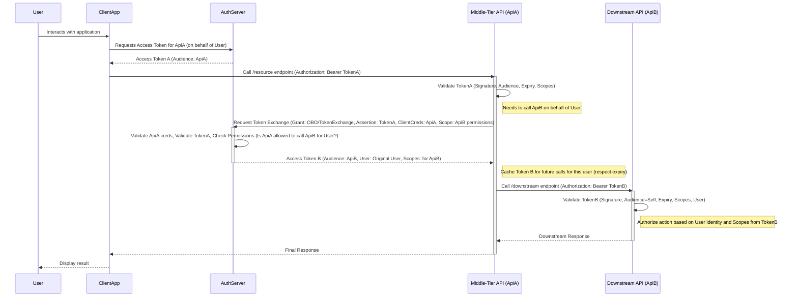

# OAuth 2.0 On-Behalf-Of (OBO) Flow Explained

The OAuth 2.0 On-Behalf-Of (OBO) flow is a crucial authorization pattern, particularly common in microservices and multi-tiered application architectures. It addresses the challenge of securely propagating a user's identity and permissions across multiple services.

## What is the On-Behalf-Of Flow?

At its core, the OBO flow allows a **middle-tier service (API)** to call a **downstream service (another API)** _on behalf of the user_ who initiated the original request to the middle-tier service. This maintains the user's identity and permissions throughout the call chain, enabling downstream services to make authorization decisions based on the original user.

In essence, the middle-tier service uses the OBO flow to tell the downstream service:

> _"Hey Downstream API, I'm the Middle-Tier API. Here's proof that User X authorized me to act. Can you now perform this specific action on behalf of User X?"_

## When Should You Use the OBO Flow?

The OBO flow is the appropriate solution when:

1.  A user interacts with a client application, which calls a middle-tier API (API A).
2.  API A needs to call another downstream API (API B) to fulfill the user's request.
3.  It's essential that API B performs its actions under the context of the *original user*, enforcing permissions and auditing actions attributed to that user, not just API A.

## The Scenario and The Problem

Imagine a typical microservices architecture:

1.  A **User** interacts with a **Client Application** (e.g., a web app, mobile app, or SPA).
2.  The Client Application calls a **Middle-Tier API (API A)** to perform some action (e.g., retrieve user profile data).
3.  API A needs data managed by a separate **Downstream API (API B)** (e.g., an orders service) to fully construct the profile data.

**The Problem:** How does API A call API B while ensuring API B knows _which user_ the request originated from and can enforce permissions based on that specific user? API A shouldn't simply use its own service identity, as that loses the user context. It needs to act _on behalf of_ the user.

## The Solution: How the OBO Flow Works Step-by-Step

The On-Behalf-Of flow elegantly solves this problem:

1.  **User Authentication & Initial Token:**
    *   The User authenticates with the **Authorization Server (AS)** (e.g., Okta, Azure AD, Keycloak).
    *   The User consents to the Client Application accessing API A.
    *   The Client Application receives an **Access Token (Token A)** from the AS. The `audience` (or `aud` claim) of Token A is typically the identifier for API A.

2.  **Client Calls Middle-Tier API (API A):**
    *   The Client Application makes a request to API A.
    *   It includes Token A in the `Authorization` header (e.g., `Authorization: Bearer <Token A>`).

3.  **Middle-Tier API (API A) Receives Request:**
    *   API A receives the request and validates Token A (checks signature, issuer, audience, expiry, scopes, etc.).
    *   API A determines it needs to call the Downstream API (API B) to complete the request. Crucially, it needs to do this _as the user_.

4.  **Middle-Tier API (API A) Requests a New Token (The OBO Exchange):**
    *   API A authenticates _itself_ to the Authorization Server's token endpoint (using its own client ID and secret, certificate, or client assertion).
    *   API A makes a token request to the AS, specifying:
        *   `grant_type`: `urn:ietf:params:oauth:grant-type:jwt-bearer` (JWT Bearer Grant) or `urn:ietf:params:oauth:grant-type:token-exchange` (Token Exchange). These indicate that an existing token is being used to request another.
        *   `assertion` (for JWT Bearer) or `subject_token` (for Token Exchange): This parameter contains the original **Token A** received from the client. This token proves the user authenticated and authorized the initial call.
        *   `subject_token_type`: (For Token Exchange) `urn:ietf:params:oauth:token-type:access_token`.
        *   `requested_token_type`: (For Token Exchange, optional, defaults usually okay) `urn:ietf:params:oauth:token-type:access_token`.
        *   `scope` or `resource`: Specifies the permissions API A needs _for the user_ on the **Downstream API (API B)**. This typically includes the identifier of API B and the specific permissions required (e.g., `api://api-b/Orders.Read`).

5.  **Authorization Server Validates and Issues New Token:**
    *   The AS validates API A's credentials.
    *   The AS validates the incoming Token A (the assertion/subject_token).
    *   The AS checks its configuration: Is API A _allowed_ to request tokens on behalf of users for API B? (This often requires pre-configuration and potentially administrative consent linking API A and API B).
    *   The AS verifies that the original user (identified in Token A) has the necessary permissions/scopes being requested for API B.
    *   If everything is valid, the AS issues a **new Access Token (Token B)**.
        *   The `audience` (`aud`) of Token B is the identifier for the **Downstream API (API B)**.
        *   Token B still contains claims identifying the _original user_ (e.g., `sub`, `oid`).
        *   The scopes in Token B are appropriate for API B, potentially an intersection of the user's permissions, API A's delegated permissions, and the requested scopes.

6.  **Middle-Tier API (API A) Receives New Token:**
    *   API A receives Token B from the Authorization Server.
    *   _Best Practice:_ API A should cache Token B (respecting its expiration time) to avoid repeatedly requesting it from the AS for subsequent calls to API B on behalf of the same user within the token's lifetime.

7.  **Middle-Tier API (API A) Calls Downstream API (API B):**
    *   API A makes a request to API B.
    *   It includes **Token B** in the `Authorization` header (e.g., `Authorization: Bearer <Token B>`).

8.  **Downstream API (API B) Validates Token and Authorizes:**
    *   API B receives the request and validates Token B (signature, issuer, audience (must be itself), expiry, scopes, user claims).
    *   API B can now perform authorization checks based on the _user's identity_ (from the claims in Token B) and the scopes granted in Token B.
    *   API B processes the request based on the original user's permissions.

9.  **Response Chain:**
    *   API B returns a response to API A.
    *   API A processes the response and returns its own response to the Client Application.
    *   The Client Application presents the result to the User.

## Visualizing the OBO Flow

This sequence diagram illustrates the interactions:



## Practical Example (Conceptual Pseudocode)

Here's a simplified pseudocode example of API A performing the token exchange:

```plaintext
// API A receives the initial request with Token A
function handleRequest(request) {
    accessTokenA = request.headers.Authorization.split(" ")[1];

    // Validate Token A (audience, signature, expiry etc.) - simplified here
    if (!isValid(accessTokenA)) {
        return Error("Invalid Token A");
    }

    // Prepare request to Authorization Server for OBO token exchange
    oboRequestPayload = {
        client_id: API_A_ClientID,
        client_secret: API_A_Secret, // Or use certificate/client assertion
        grant_type: "urn:ietf:params:oauth:grant-type:jwt-bearer", // Or token-exchange
        assertion: accessTokenA, // The token received from the client
        scope: "api://api-b/Orders.Read api://api-b/Orders.Write", // Scopes needed for API B
        requested_token_use: "on_behalf_of" // Common parameter, esp. in Azure AD
    };

    // Make the POST request to the token endpoint
    try {
        oboResponse = httpClient.post("https://authserver.com/token", oboRequestPayload);

        // Extract the new Access Token (Token B) for API B
        accessTokenB = oboResponse.access_token;

        // Now, call API B using Token B
        apiBResponse = callApiB(accessTokenB);

        // Process apiBResponse and return final result to client
        return processResponse(apiBResponse);

    } catch (error) {
        // Handle errors from token exchange or API B call
        logError(error);
        return Error("Failed to process request downstream");
    }
}

function callApiB(tokenB) {
    headers = {
        Authorization: "Bearer " + tokenB
    };
    // Make authenticated call to API B endpoint
    response = httpClient.get("https://api-b.com/orders", headers);
    return response;
}
```

## Benefits of the OBO Flow

Using the On-Behalf-Of flow provides significant advantages in distributed systems:

1.  **Identity Propagation:** Securely carries the user's identity across service boundaries.
2.  **Principal Preservation:** Ensures the original caller (the user) remains the security principal for authorization decisions throughout the request chain.
3.  **Fine-Grained Authorization:** Allows downstream services (like API B) to enforce permissions based on the actual user's roles and rights, not just the calling service's (API A) identity.
4.  **Auditing:** Enables accurate and meaningful auditing of actions performed *by specific users*, even when those actions involve multiple backend services.
5.  **Least Privilege:** Enforces security best practices. API A requests and receives a token (Token B) scoped *only* for the necessary actions on API B. The initial token (Token A) cannot be used directly against API B, and Token B typically cannot be used against API A, limiting the blast radius if a token is compromised.

## Key Considerations and Best Practices

Implementing OBO requires careful planning:

*   **Configuration Complexity:** Requires precise configuration at the Authorization Server. You need to define the applications (Client, API A, API B), their relationships, and specifically permit API A to request tokens for API B on behalf of users.
*   **Consent:** The user initially consents to the client application accessing the first API (API A). The delegation step (API A obtaining tokens for API B) often requires *administrative consent* or pre-configuration in the AS, signifying that the organization trusts API A to act this way. End-user consent might not be explicitly prompted for this delegation step if admin consent is in place.
*   **Token Caching:** Caching the obtained OBO token (Token B) in the middle-tier service (API A) is crucial for performance. Cache the token based on the user and the required scopes, respecting its `expires_in` time. Avoid redundant calls to the AS for the same user/scope combination while the token is valid.
*   **Error Handling:** Implement robust error handling for scenarios like invalid incoming tokens (Token A), failed OBO exchange (e.g., API A not permitted, user lacks permissions for API B scopes), network issues contacting the AS, or errors from the downstream API (API B).
*   **Secure Token Transmission:** Always use HTTPS (TLS) for all communication involving tokens (client-to-API A, API A-to-AS, API A-to-API B) to prevent interception.
*   **Secure Token Storage (if applicable):** While OBO tokens are often short-lived and used immediately, if caching mechanisms involve storage, ensure it's secure. Avoid logging tokens.
*   **Minimal Privileges:** When API A requests Token B, it should request only the minimum necessary scopes required for the specific operation on API B.

## Common Pitfalls & Troubleshooting

*   **Incorrect Scopes:** API B rejects Token B. Verify that API A requested the correct scopes during the OBO exchange and that these scopes are configured on API B and granted to the user (or API A via delegated permissions).
*   **Misconfigured Client Credentials/Permissions:** The AS rejects the OBO request from API A. Ensure API A's client ID/secret (or certificate/assertion) is correct and that API A has been granted permission in the AS to perform the OBO flow for API B. Check for necessary admin consent.
*   **Audience Mismatch:** API B rejects Token B because the `aud` claim doesn't match its own identifier. Ensure the AS is correctly configured to issue tokens with the right audience during the OBO exchange.
*   **Consent Issues:** The OBO exchange fails due to missing user or administrative consent for the requested scopes/delegation. Review the AS configuration and consent framework.
*   **Clock Skew:** Token validation fails due to time differences between servers (AS, API A, API B). Ensure servers are synchronized using NTP.

## Alternatives to OBO Flow

While OBO is often the ideal pattern for user identity propagation, other methods exist, each with trade-offs:

1.  **Client Credentials Flow (Service Identity Only)**
    *   **How it works:** API A authenticates *itself* to the AS using its own client ID/secret. It gets a token representing API A's identity, not the user's.
    *   **User Context:** Lost. API B only knows API A called it.
    *   **Pros:** Simpler setup. Standard OAuth flow. Good for system-to-system calls or background tasks where user context isn't needed downstream.
    *   **Cons:** No user identity propagation. API B cannot perform user-specific authorization or auditing.
    *   **Use Case:** A nightly batch job service (API A) fetching aggregated, non-user-specific data from a reporting service (API B).

    ```mermaid
    sequenceDiagram
        participant User
        participant ClientApp
        participant AuthServer
        participant ApiA as Middle-Tier API (ApiA)
        participant ApiB as Downstream API (ApiB)

        User->>ClientApp: Interacts (Optional: To initiate process)
        ClientApp->>ApiA: Call /resource endpoint (Maybe with User Token A)
        activate ApiA
        ApiA->>ApiA: Process request (User context potentially used here)
        note right of ApiA: Needs to call ApiB using its own identity

        ApiA->>AuthServer: Request Access Token (Grant: client_credentials, ClientCreds: ApiA, Scope: ApiB permissions)
        activate AuthServer
        AuthServer->>AuthServer: Validate ApiA credentials & permissions for ApiB
        AuthServer-->>ApiA: Access Token B (Audience: ApiB, Represents: ApiA Service Principal)
        deactivate AuthServer

        ApiA->>ApiB: Call /system endpoint (Authorization: Bearer TokenB)
        activate ApiB
        ApiB->>ApiB: Validate TokenB (Signature, Audience=Self, Expiry, Scopes)
        note right of ApiB: Authorize based on ApiA's service identity/permissions
        ApiB-->>ApiA: System Response
        deactivate ApiB
        ApiA-->>ClientApp: Final Response (Optional: If user initiated)
        deactivate ApiA
        ClientApp-->>User: Display result (Optional)
    ```

2.  **Token Forwarding / Token Passing (Direct Use of Original Token)**
    *   **How it works:** API A receives Token A (intended for API A) and simply forwards it to API B.
    *   **User Context:** Preserved (if claims are present).
    *   **Pros:** Conceptually simple, no extra calls to AS.
    *   **Cons:**
        *   **Audience Mismatch:** Major security issue. API B should reject Token A because its `aud` claim is for API A. Requires insecurely relaxing audience validation or issuing multi-audience tokens (complex, increases token size).
        *   **Over-Privileging:** Token A might grant permissions API B doesn't need.
        *   **Security Risk:** Exposes the same token to multiple services.
    *   **Use Case:** Generally discouraged. Might be seen in tightly coupled internal systems with relaxed validation, but OBO is preferred.

    ```mermaid
    sequenceDiagram
        participant User
        participant ClientApp
        participant AuthServer
        participant ApiA as Middle-Tier API (ApiA)
        participant ApiB as Downstream API (ApiB)

        User->>ClientApp: Interacts with application
        ClientApp->>AuthServer: Requests Access Token for ApiA (or maybe ApiA+ApiB audience)
        AuthServer-->>ClientApp: Access Token A (Audience: ApiA - **Problematic for ApiB**)

        ClientApp->>ApiA: Call /resource endpoint (Authorization: Bearer TokenA)
        activate ApiA
        ApiA->>ApiA: Validate TokenA (Signature, Audience, Expiry, Scopes)
        note right of ApiA: Decides to forward the same token to ApiB

        ApiA->>ApiB: Call /downstream endpoint (Authorization: Bearer TokenA)
        activate ApiB
        ApiB->>ApiB: Validate TokenA (Signature, Expiry, Scopes)
        note over ApiB: **Warning:** Audience check likely fails (expects ApiB, gets ApiA)! Requires insecure config or multi-audience token.
        ApiB->>ApiB: Authorize based on User from TokenA (if validation passes)
        ApiB-->>ApiA: Downstream Response
        deactivate ApiB

        ApiA-->>ClientApp: Final Response
        deactivate ApiA
        ClientApp-->>User: Display result
    ```

3.  **Propagating Identity via Custom Headers / Claims (Trusted Subsystem)**
    *   **How it works:** API A validates Token A, extracts user identity (e.g., ID, roles), and sends this info to API B in custom HTTP headers (`X-User-ID`, etc.). API B *trusts* API A.
    *   **User Context:** Preserved (as asserted by API A).
    *   **Pros:** Avoids AS calls for token exchange. Potentially simpler if trust exists.
    *   **Cons:**
        *   **Requires Strong Trust:** API B *must* implicitly trust API A. This trust needs a strong foundation (e.g., mutual TLS between services, secure network boundaries).
        *   **Security Risk:** If API A is compromised, it can impersonate any user to API B.
        *   **Non-Standard:** Relies on custom conventions.
        *   **Auditing Challenges:** Central audit logs at the AS won't reflect these delegations.
    *   **Use Case:** Internal services within a tightly controlled environment (e.g., secure VPC with mTLS) where infrastructure enforces trust.

    ```mermaid
    sequenceDiagram
        participant User
        participant ClientApp
        participant AuthServer
        participant ApiA as Middle-Tier API (ApiA)
        participant ApiB as Downstream API (ApiB)

        User->>ClientApp: Interacts with application
        ClientApp->>AuthServer: Requests Access Token for ApiA
        AuthServer-->>ClientApp: Access Token A (Audience: ApiA)

        ClientApp->>ApiA: Call /resource endpoint (Authorization: Bearer TokenA)
        activate ApiA
        ApiA->>ApiA: Validate TokenA (Signature, Audience, Expiry, Scopes)
        ApiA->>ApiA: Extract UserID from TokenA claims
        note right of ApiA: Will send UserID in a custom header to ApiB

        ApiA->>ApiB: Call /downstream endpoint (Header: X-User-ID: {UserID}, [Often with mTLS Auth])
        activate ApiB
        note over ApiB: **Trust Assumption:** ApiB trusts ApiA based on network/mTLS etc. It accepts the UserID header.
        ApiB->>ApiB: Read UserID from X-User-ID header
        ApiB->>ApiB: Authorize based on received UserID
        ApiB-->>ApiA: Downstream Response
        deactivate ApiB

        ApiA-->>ClientApp: Final Response
        deactivate ApiA
        ClientApp-->>User: Display result
    ```

4.  **Service Mesh Identity Propagation**
    *   **How it works:** Technologies like Istio or Linkerd use sidecar proxies. API A calls API B; traffic is intercepted. Sidecars can establish service-to-service trust (e.g., mTLS via SPIFFE/SPIRE). More advanced setups might inspect tokens/headers and enforce policies, potentially integrating with external CAs or even facilitating OBO-like exchanges, but often relies on patterns like trusted headers (#3) secured by the mesh mTLS.
    *   **User Context:** Varies. Often just service identity unless explicitly configured for user identity propagation (often using trusted headers).
    *   **Pros:** Offloads mTLS, some policy enforcement. Infrastructure-level trust.
    *   **Cons:** Infrastructure complexity. User identity propagation still often requires application-level patterns or complex mesh configuration.
    *   **Use Case:** Environments heavily invested in service mesh, often combined with other patterns.

5.  **API Gateway Assertion / Transformation**
    *   **How it works:** An API Gateway intercepts calls to both API A and API B. The Gateway validates the initial token (Token A). When API A calls API B *through the gateway*, the gateway can perform the OBO exchange itself, inject trusted headers, or attach a new assertion about the user.
    *   **User Context:** Preserved.
    *   **Pros:** Centralizes security logic (OBO, validation, assertion). Simplifies backend services.
    *   **Cons:** Gateway becomes critical infrastructure. Requires a capable gateway product. Configuration can be complex.
    *   **Use Case:** Architectures leveraging a central API Gateway for security policy enforcement.

    ```mermaid
    sequenceDiagram
        participant User
        participant ClientApp
        participant ApiGateway
        participant AuthServer
        participant ApiA as Middle-Tier API (ApiA)
        participant ApiB as Downstream API (ApiB)

        User->>ClientApp: Interacts with application
        ClientApp->>AuthServer: Requests Access Token for ApiA (audience might be Gateway or ApiA)
        AuthServer-->>ClientApp: Access Token A

        ClientApp->>ApiGateway: Call /apiA/resource (Authorization: Bearer TokenA)
        activate ApiGateway
        ApiGateway->>ApiGateway: Validate TokenA
        ApiGateway->>ApiA: Forward Request /resource (Optionally inject User Info)
        activate ApiA
        note right of ApiA: Needs to call ApiB

        ApiA->>ApiGateway: Call /apiB/downstream (ApiA might authenticate itself to Gateway)
        ApiGateway->>ApiGateway: Identify incoming call is from trusted ApiA
        alt OBO performed by Gateway
            ApiGateway->>AuthServer: Request Token Exchange (using TokenA received earlier, ClientCreds: Gateway/ApiA, Scope: ApiB)
            activate AuthServer
            AuthServer-->>ApiGateway: Access Token B (Audience: ApiB, User: Original User)
            deactivate AuthServer
            ApiGateway->>ApiB: Forward Request /downstream (Authorization: Bearer TokenB)
        else Trusted Header Injection by Gateway
             ApiGateway->>ApiGateway: Extract UserID from validated TokenA
             ApiGateway->>ApiB: Forward Request /downstream (Header: X-User-ID: {UserID})
        end
        activate ApiB
        ApiB->>ApiB: Validate TokenB OR Trust Header from Gateway
        ApiB->>ApiB: Authorize based on User Identity
        ApiB-->>ApiGateway: Downstream Response
        deactivate ApiB

        ApiGateway-->>ApiA: Response from ApiB call
        ApiA-->>ApiGateway: Final Response for /apiA/resource
        deactivate ApiA
        ApiGateway-->>ClientApp: Final Response
        deactivate ApiGateway
        ClientApp-->>User: Display result
    ```

## Comparison Summary

| Pattern                 | User Identity Propagated | Security Principal         | Complexity | Standardisation   | Key Characteristic                                  |
| :---------------------- | :----------------------- | :------------------------- | :--------- | :---------------- | :-------------------------------------------------- |
| **On-Behalf-Of (OBO)**  | **Yes**                  | User (Delegated)           | Medium     | High (OAuth Ext.) | Token exchange by middle-tier service. Strongest security. |
| Client Credentials      | No                       | Service                    | Low        | High (OAuth Core) | Middle-tier uses its own identity. User context lost. |
| Token Forwarding        | Yes (Insecurely)         | User (Potentially)         | Low        | Low (Practice)


